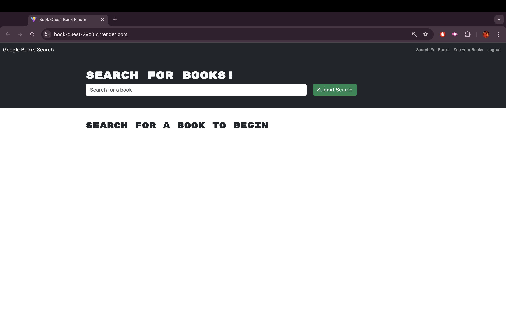

# 📖 Book Quest Book Finder

[](https://github.com/trishamasbate)
[](https://choosealicense.com/licenses/mit/)


## 📃 Description
**Book Quest** is a project that enhances an existing Google Books API search engine by refactoring it from a traditional RESTful API to a modern GraphQL API, leveraging Apollo Server for efficient data querying and management. The app is built using the MERN stack, with a React front end, MongoDB database, and Node.js/Express.js server and API.

## 📌 Table of Contents
- [📖 Book Quest Book Finder](#-book-quest-book-finder)
  - [📃 Description](#-description)
  - [📌 Table of Contents](#-table-of-contents)
  - [🔎 User Story](#-user-story)
  - [✅ Acceptance Criteria](#-acceptance-criteria)
  - [💡 Usage and Installation Instructions](#-usage-and-installation-instructions)
  - [🎞️ Application Previews](#️-application-previews)
  - [🗝️ Resources](#️-resources)
  - [❓ Questions](#-questions)
  - [🪪 License](#-license)

## 🔎 User Story
```md
AS AN avid reader
I WANT to search for new books to read
SO THAT I can keep a list of books to purchase
```

## ✅ Acceptance Criteria
```md
GIVEN a book search engine
WHEN I load the search engine
THEN I am presented with a menu with the options Search for Books and Login/Signup and an input field to search for books and a submit button
WHEN I click on the Search for Books menu option
THEN I am presented with an input field to search for books and a submit button
WHEN I am not logged in and enter a search term in the input field and click the submit button
THEN I am presented with several search results, each featuring a book’s title, author, description, image, and a link to that book on the Google Books site
WHEN I click on the Login/Signup menu option
THEN a modal appears on the screen with a toggle between the option to log in or sign up
WHEN the toggle is set to Signup
THEN I am presented with three inputs for a username, an email address, and a password, and a signup button
WHEN the toggle is set to Login
THEN I am presented with two inputs for an email address and a password and login button
WHEN I enter a valid email address and create a password and click on the signup button
THEN my user account is created and I am logged in to the site
WHEN I enter my account’s email address and password and click on the login button
THEN I the modal closes and I am logged in to the site
WHEN I am logged in to the site
THEN the menu options change to Search for Books, an option to see my saved books, and Logout
WHEN I am logged in and enter a search term in the input field and click the submit button
THEN I am presented with several search results, each featuring a book’s title, author, description, image, and a link to that book on the Google Books site and a button to save a book to my account
WHEN I click on the Save button on a book
THEN that book’s information is saved to my account
WHEN I click on the option to see my saved books
THEN I am presented with all of the books I have saved to my account, each featuring the book’s title, author, description, image, and a link to that book on the Google Books site and a button to remove a book from my account
WHEN I click on the Remove button on a book
THEN that book is deleted from my saved books list
WHEN I click on the Logout button
THEN I am logged out of the site and presented with a menu with the options Search for Books and Login/Signup and an input field to search for books and a submit button
```

## 💡 Usage and Installation Instructions
✨ **Using Render:**

[Book Quest Website](https://book-quest-29c0.onrender.com/)

✨ **Using the GitHub Repository:**

1.  Clone the repository:
```
https://github.com/trishamasbate/book-quest
```
2.  Provide your MongoDB Atlas database credentials in a `.env` file. Make sure to supply your `username`, `password`, and `database name`. Follow this format:
```
MONGODB_URI=mongodb+srv://<username>:<password>@cluster0.44mlj.mongodb.net/<databasename>?retryWrites=true&w=majority&appName=Cluster0
```
3.	Launch an integrated terminal directly from your editor.
4.  Install the necessary packages to initialize the application. You can also execute the command `npm install`.
5.  Run the `npm build` command to initialize the production.  
6.	Execute `npm run develop` to deploy the application in development.
7.  Test the functionality of the application by using Render.


## 🎞️ Application Previews

**Login Page**


**Sign Up Page**


**Landing Page**


**Searched Books**


**Saved Books**


## 🗝️ Resources
- Dynamic JavaScript
- License Badge: [Shields.io](https://shields.io/)
- [Starter Code](https://github.com/coding-boot-camp/solid-broccoli)
- [Nodemon](https://www.npmjs.com/package/nodemon)
- [Dotenv](https://www.npmjs.com/package/dotenv)
- [Bycrypt](https://www.npmjs.com/package/bcrypt)
- [ESLint](https://www.npmjs.com/package/eslint)
- [React](https://www.npmjs.com/package/react)
- [Vite](https://www.npmjs.com/package/vite)
- [Concurrently](https://www.npmjs.com/package/concurrently)
- [Apollo Client](https://www.npmjs.com/package/@apollo/client)
- [Express](https://www.npmjs.com/package/express)
- [Jsonwebtoken](https://www.npmjs.com/package/jsonwebtoken)
- [Mongoose](https://www.npmjs.com/package/mongoose)
- [JWT-Decode](https://www.npmjs.com/package/jwt-decode)
- [GraphQL](https://www.npmjs.com/package/graphql)
- [Bootstrap](https://www.npmjs.com/package/bootstrap)
- [Visual Studio Code](https://code.visualstudio.com/)


## ❓ Questions
Contact the author with any questions!<br>
Github link: [trishamasbate](https://github.com/trishamasbate)<br>
Email: trisha.masbate@gmail.com

## 🪪 License
This project is [MIT](https://choosealicense.com/licenses/mit/) licensed.<br />

Copyright © 2024 [TRISHA MASBATE](https://github.com/trishamasbate)
  
<hr>
<p align='center'><i>
All the best! 🤟🏻 TRISHA MASBATE
</i></p>